# Projekt Lötstation

Wir haben in unserem Makerspace drei Maiskolben Lötstationen, gebaut nach der Anleitung in [Make Lötstation](https://www.heise.de/select/make/2016/5/1476695937422186).

[Video](./in_action.MP4)

## Tasten

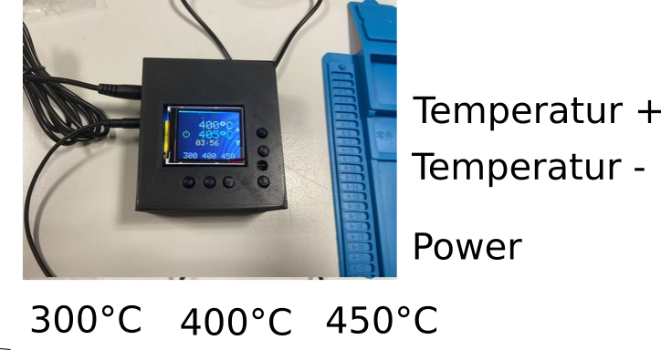

## Schaltplan

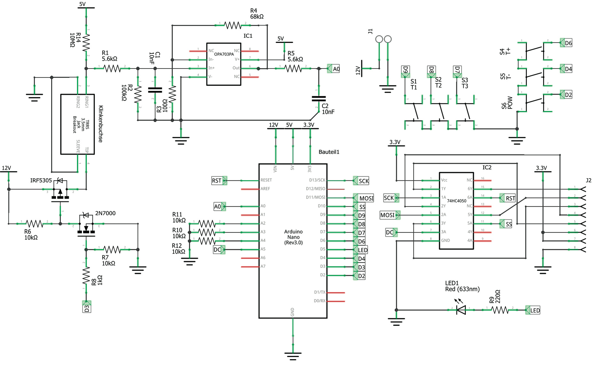

## Hardware

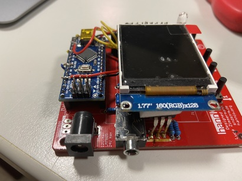

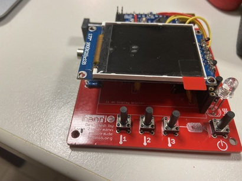

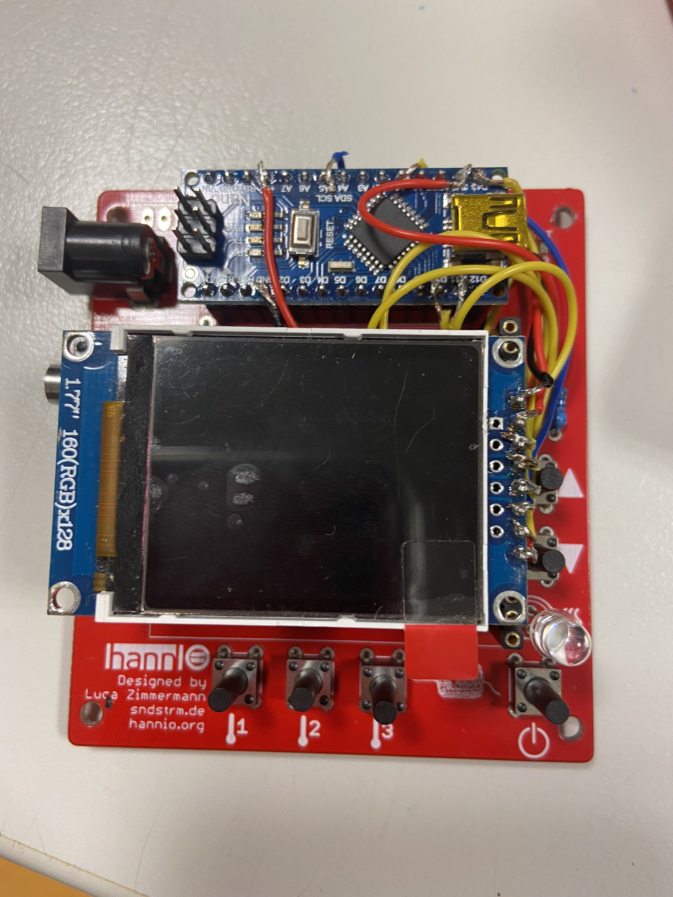

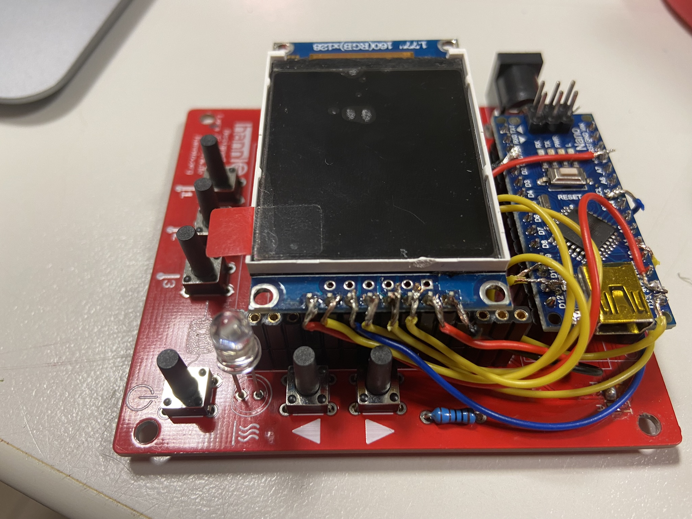

## Löten

### Verbinden

- Lötspitze anschließen:

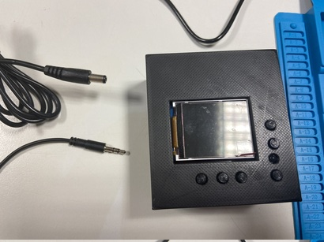

- Strom anschließen:

- Warten bis die Lötstation hochgefahren ist:

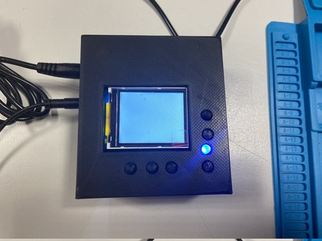

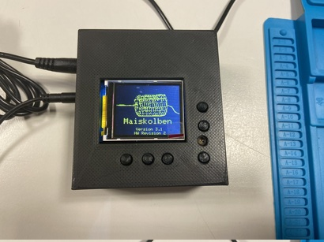

### Betriebszustände

- Ausgeschaltet

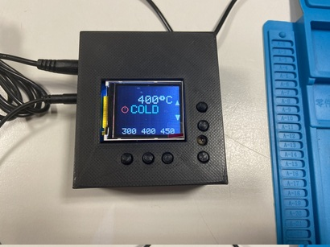

- Eingeschaltet:

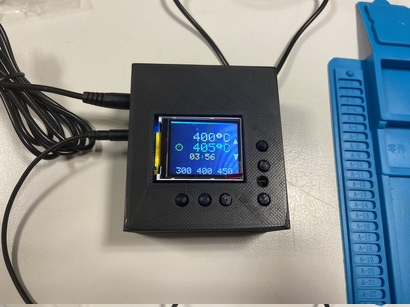

- Standby:

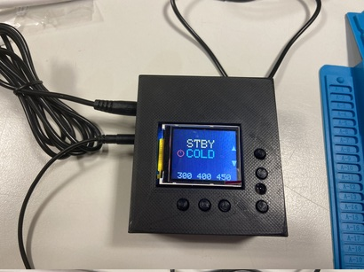

Viel Spaß beim Löten!

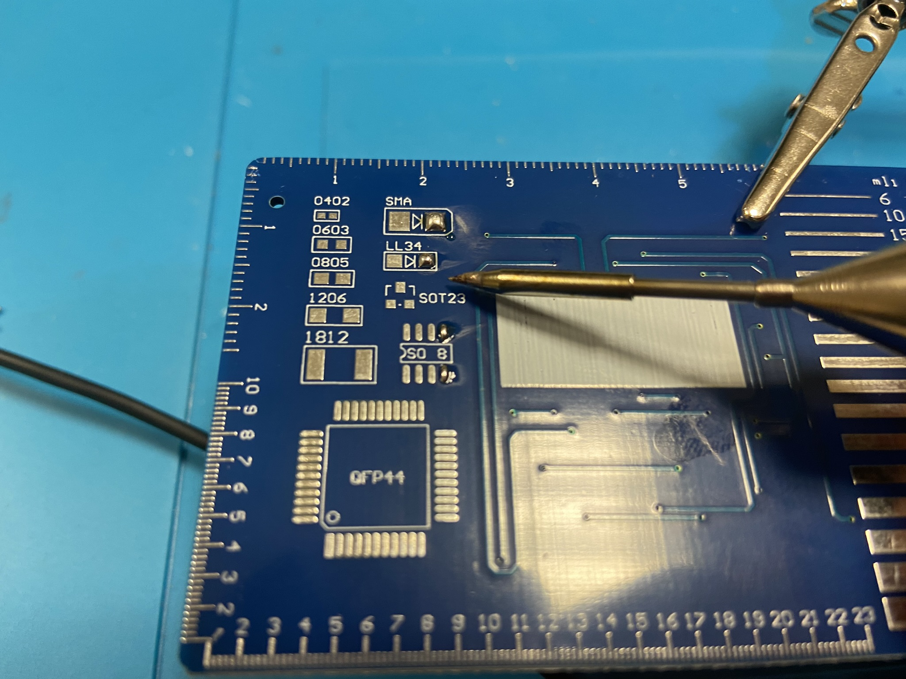

