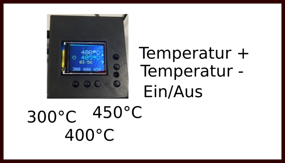

# Projekt Lötstation

Wir haben in unserem Makerspace drei Maiskolben Lötstationen, gebaut nach der Anleitung in [Make Lötstation](https://www.heise.de/select/make/2016/5/1476695937422186).

[Video](./in_action.MP4)

## Tasten

## Schaltplan

## Hardware

## Löten

### Verbinden

- Lötspitze anschließen:

- Strom anschließen:

- Warten bis die Lötstation hochgefahren ist:

### Betriebszustände

- Ausgeschaltet

- Eingeschaltet:

- Standby:

Viel Spaß beim Löten!

